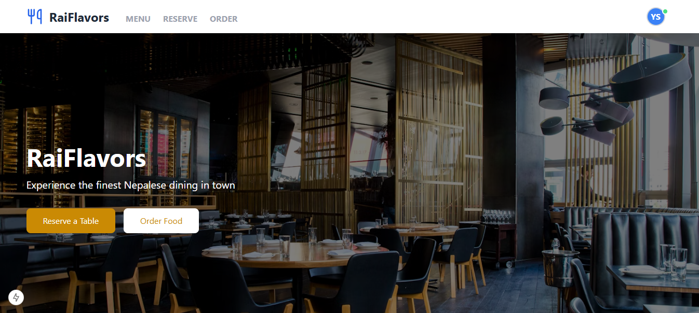
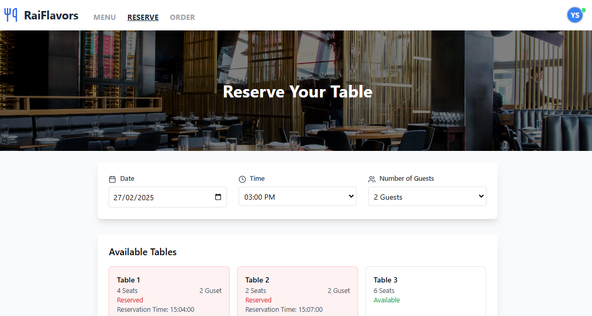
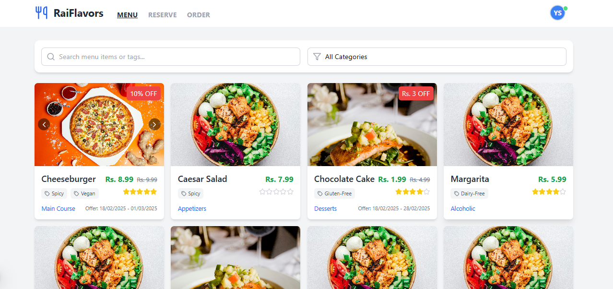
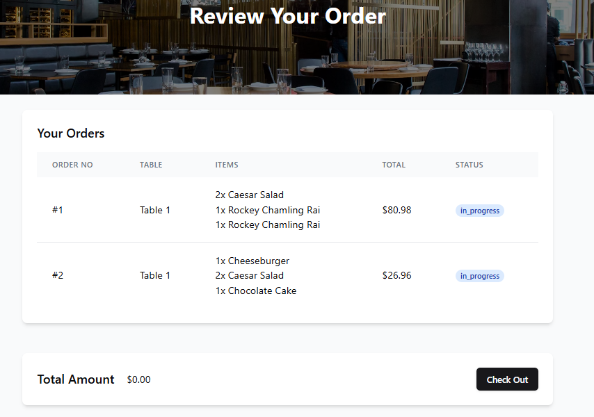
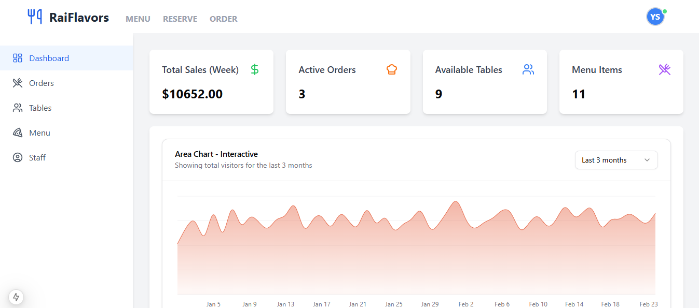
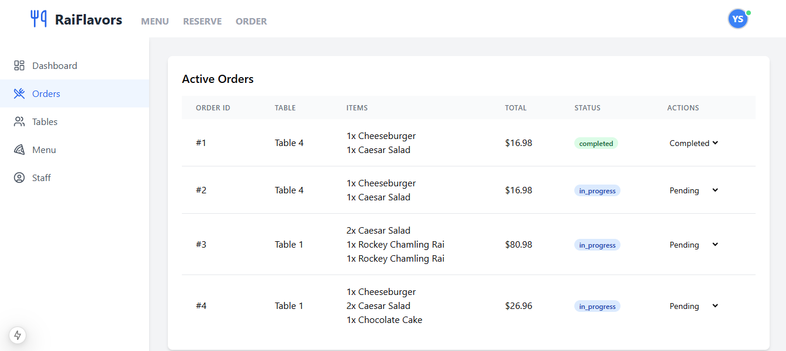
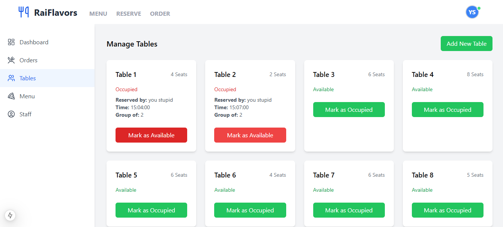
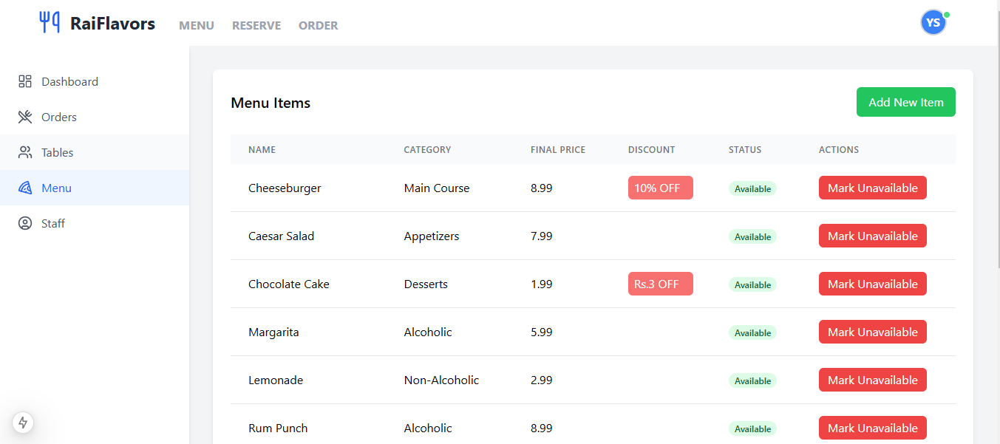
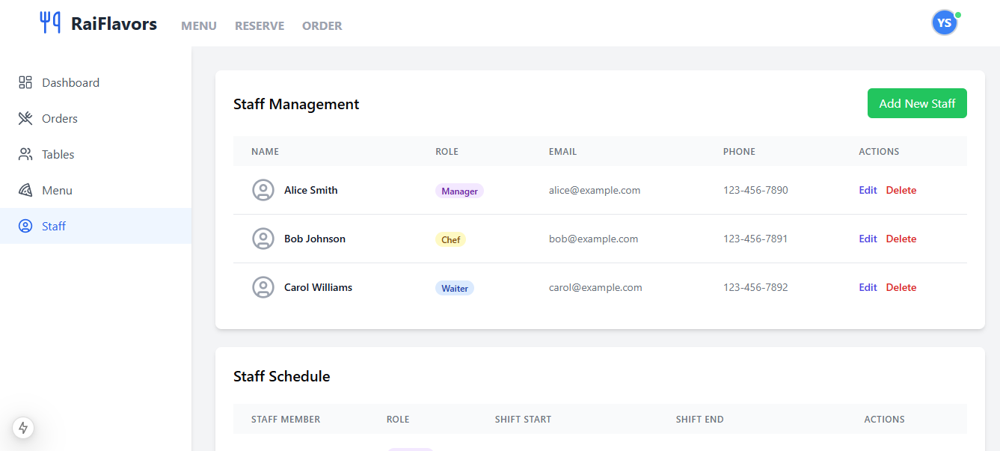

# Restaurant Management System

## Introduction
The **Restaurant Management System** is a robust web application designed to streamline restaurant operations. From managing orders, reservations, and menus to handling staff and seating arrangements, this system provides a comprehensive solution for restaurant owners and managers.

Built with the latest technologies, this application ensures performance, scalability, and a seamless user experience. The project leverages modern tools like Next.js, Redux Toolkit, and MongoDB/MySQL for efficient state management, dynamic routing, and robust data handling.

---

## Project Preview
|  |  |  |  |
|--------------------------------|--------------------------------|--------------------------------|--------------------------------|
| Demo 1                         | Demo 2                         | Demo 3                         | Demo 4                         |

|  |  |  |  |
|--------------------------------|--------------------------------|--------------------------------|--------------------------------|
| Demo 5                         | Demo 6                         | Demo 7                         | Demo 8                         |


---

## Features
- **User Authentication**: Secure login and registration with JWT and bcrypt.js.
- **Table Management**:  Real-time reservation for table .
- **Order Management**: Real-time order tracking using Socket.io.
- **Menu Management**: Add, update, or remove menu items seamlessly.
- **Reservation System**: Handle table reservations efficiently.
- **Staff Management**: Manage staff roles, shifts, and permissions.
- **Analytics Dashboard**: Visualize key metrics using Recharts.
- **Responsive Design**: Fully optimized for mobile, tablet, and desktop devices.

---

## Dependencies
Below are the primary dependencies used in this project:

### Frontend
- **[@reduxjs/toolkit](https://redux-toolkit.js.org/)**: Efficient state management.
- **[axios](https://axios-http.com/)**: For API calls.
- **[lucide-react](https://lucide.dev/)**: Icons for the UI.
- **[next.js](https://nextjs.org/)**: Framework for server-side rendering and routing.
- **[react](https://reactjs.org/)**: Library for building user interfaces.
- **[react-redux](https://react-redux.js.org/)**: Binding React with Redux.
- **[react-select](https://react-select.com/)**: Dropdown component for dynamic selection.
- **[recharts](https://recharts.org/)**: For data visualization.
- **[redux-persist](https://github.com/rt2zz/redux-persist)**: Persistent state storage.
- **[socket.io-client](https://socket.io/)**: Real-time communication with the backend.

### Backend
- **[bcryptjs](https://github.com/dcodeIO/bcrypt.js/)**: Password hashing.
- **[cors](https://github.com/expressjs/cors)**: Cross-origin resource sharing.
- **[dotenv](https://github.com/motdotla/dotenv)**: Environment variable management.
- **[express](https://expressjs.com/)**: Backend server framework.
- **[jsonwebtoken](https://github.com/auth0/node-jsonwebtoken)**: Token-based authentication.
- **[mongoose](https://mongoosejs.com/)**: MongoDB object modeling.
- **[mysql2](https://github.com/sidorares/node-mysql2)**: MySQL database support.
- **[socket.io](https://socket.io/)**: Real-time event-based communication.

---

## Getting Started

### Installation
1. Clone the repository:
   ```bash
   https://github.com/rockeyrai/RestaurantV3
   ```

### Setup

####Backend
1. Install  dependencies:
   ```bash
   cd server
   npm install express
   npm run dev
   ```
2. Configure environment variables in `.env` file for server:
   ```env
    MY_PORT=8000
    DB_HOST=localhost
    DB_USER=root
    DB_PASSWORD='*#$(req)405R@i'
    DB_NAME=restaurant3
    JWT_SECRET=98030300dfadgfsa
    FRONTEND_URL=http://localhost:3000
    NODE_ENV=development
   ```
3. Start the backend server:
   ```bash
   npm start
   ```

#### Frontend
1. Install frontend dependencies:
   ```bash
   cd client
   npm install next
   ```
2. Configure environment variables in `.env` file for client:
   ```bash
    NEXT_PUBLIC_FRONTEND_API=http://localhost:8000/
   ```
2. Run the frontend application:
   ```bash
   npm run dev
   ```
   
#### Database

##### Past this in your SQL database. Remember to put the Categories and Tags before adding Food Menu.

```bash
-- Users Table
CREATE TABLE Users (
    user_id INT AUTO_INCREMENT PRIMARY KEY,
    username VARCHAR(255) NOT NULL UNIQUE,
    email VARCHAR(255) UNIQUE NOT NULL,
    password_hash VARCHAR(255) NOT NULL,
    role ENUM('customer', 'admin') DEFAULT 'customer',
    created_at TIMESTAMP DEFAULT CURRENT_TIMESTAMP
);

-- Categories Table (with parent category for subcategories)
CREATE TABLE Categories (
    category_id INT AUTO_INCREMENT PRIMARY KEY,
    name VARCHAR(100) NOT NULL UNIQUE,
    parent_category_id INT NULL,
    created_at TIMESTAMP DEFAULT CURRENT_TIMESTAMP,
    FOREIGN KEY (parent_category_id) REFERENCES Categories(category_id)
);

CREATE TABLE Menu_Item_Ratings (
    rating_id INT AUTO_INCREMENT PRIMARY KEY,
    menu_item_id INT NOT NULL,
    user_id INT NOT NULL,
    rating DECIMAL(2,1) NOT NULL CHECK (rating BETWEEN 1.0 AND 5.0),
    created_at TIMESTAMP DEFAULT CURRENT_TIMESTAMP,
    updated_at TIMESTAMP DEFAULT CURRENT_TIMESTAMP ON UPDATE CURRENT_TIMESTAMP,
    FOREIGN KEY (menu_item_id) REFERENCES Menu(menu_item_id) ON DELETE CASCADE,
    FOREIGN KEY (user_id) REFERENCES Users(user_id) ON DELETE CASCADE,
    UNIQUE (menu_item_id, user_id) -- Ensures a user can only rate a menu item once
);

-- Menu Table (including a dynamic pricing mechanism)
CREATE TABLE Menu (
    menu_item_id INT AUTO_INCREMENT PRIMARY KEY,
    name VARCHAR(255) NOT NULL,
    description TEXT,
    price DECIMAL(10, 2) NOT NULL,
    availability BOOLEAN DEFAULT TRUE,
    rating DECIMAL(2,1) DEFAULT 0 CHECK (rating <= 5.0),
    category_id INT,
    created_at TIMESTAMP DEFAULT CURRENT_TIMESTAMP,
    updated_at TIMESTAMP DEFAULT CURRENT_TIMESTAMP ON UPDATE CURRENT_TIMESTAMP,
    FOREIGN KEY (category_id) REFERENCES Categories(category_id)
);

-- Menu Images Table (for multiple images per menu item)
CREATE TABLE Menu_Images (
    image_id INT AUTO_INCREMENT PRIMARY KEY,
    menu_item_id INT,
    image_url VARCHAR(255),
    FOREIGN KEY (menu_item_id) REFERENCES Menu(menu_item_id)
);

-- Tags Table (for item categorization like 'vegan', 'spicy', etc.)
CREATE TABLE Tags (
    tag_id INT AUTO_INCREMENT PRIMARY KEY,
    name VARCHAR(50) NOT NULL UNIQUE
);

-- Menu Tags Table (many-to-many relationship between menu items and tags)
CREATE TABLE Menu_Tags (
    menu_item_id INT,
    tag_id INT,
    FOREIGN KEY (menu_item_id) REFERENCES Menu(menu_item_id),
    FOREIGN KEY (tag_id) REFERENCES Tags(tag_id)
);

-- Offers Table (managing discounts)
CREATE TABLE Offers (
    offer_id INT AUTO_INCREMENT PRIMARY KEY,
    menu_item_id INT,
    discount_percentage DECIMAL(5, 2),
    min_order_value DECIMAL(10, 2) DEFAULT 0.00,
    offer_type ENUM('percentage', 'fixed_price'),
    start_date DATE,
    end_date DATE,
    FOREIGN KEY (menu_item_id) REFERENCES Menu(menu_item_id)
);

-- Dynamic Pricing Table (for price adjustments based on time)
CREATE TABLE Dynamic_Pricing (
    pricing_id INT AUTO_INCREMENT PRIMARY KEY,
    menu_item_id INT,
    price DECIMAL(10, 2) NOT NULL,
    start_time TIME,
    end_time TIME,
    days_of_week SET('Mon', 'Tue', 'Wed', 'Thu', 'Fri', 'Sat', 'Sun'),
    FOREIGN KEY (menu_item_id) REFERENCES Menu(menu_item_id)
);

-- Staff Table (staff roles and details)
CREATE TABLE Staff (
    staff_id INT AUTO_INCREMENT PRIMARY KEY,
    name VARCHAR(255) NOT NULL,
    email VARCHAR(255) UNIQUE NOT NULL,
    phone_number VARCHAR(15),
    role ENUM('manager', 'chef', 'waiter', 'cashier') DEFAULT 'waiter',
    created_at TIMESTAMP DEFAULT CURRENT_TIMESTAMP
);

-- Staff Schedule Table (staff shift schedules)
CREATE TABLE Staff_Schedule (
    schedule_id INT AUTO_INCREMENT PRIMARY KEY,
    staff_id INT,
    shift_start DATETIME,
    shift_end DATETIME,
    created_at TIMESTAMP DEFAULT CURRENT_TIMESTAMP,
    FOREIGN KEY (staff_id) REFERENCES Staff(staff_id)
);

-- Tables Table (managing restaurant tables)
CREATE TABLE Tables (
    id INT AUTO_INCREMENT PRIMARY KEY,
    table_number INT NOT NULL UNIQUE,
    seats INT NOT NULL,
    available BOOLEAN DEFAULT TRUE,
    order_id VARCHAR(24),
    user_id INT NULL, -- Newly added column,
    reserve_time TIME NULL,
    reserve_date DATE NULL,
    no_of_people INT NULL;
    created_at TIMESTAMP DEFAULT CURRENT_TIMESTAMP,
    FOREIGN KEY (user_id) REFERENCES Users(user_id) -- Foreign key constraint
);

```
---

## Contribution
Feel free to fork the repository and submit pull requests for any enhancements or bug fixes.

---

## License
This project is licensed under the MIT License. See the `LICENSE` file for details.

---

## Contact
For any inquiries or support, please contact:
- **Name**: Rockey Chamling Rai
- **Email**: rockeyrai234@gamil.com
- **LinkedIn**: [ LinkedIn Profile](https://www.linkedin.com/in/rockey-rai-669310305/)
